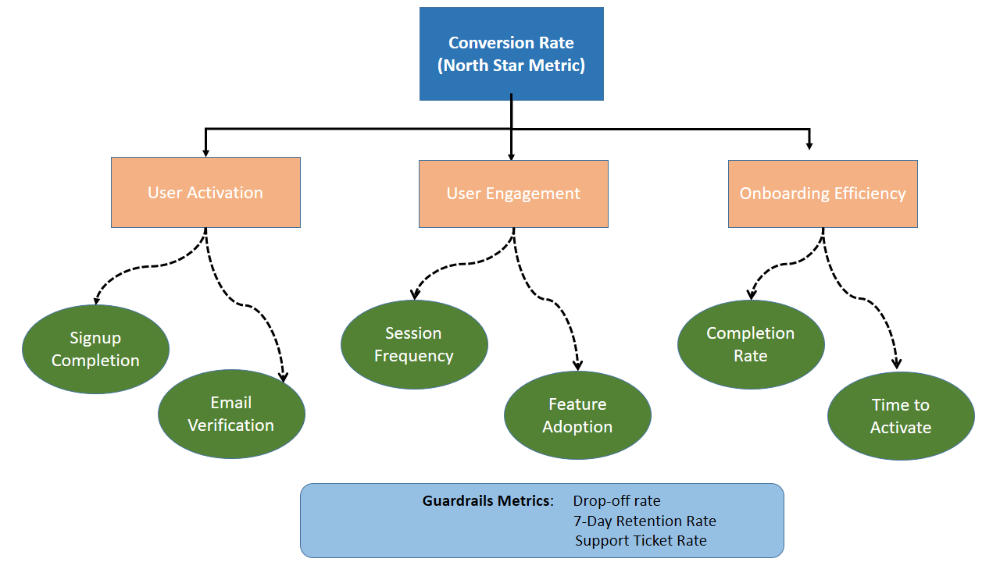
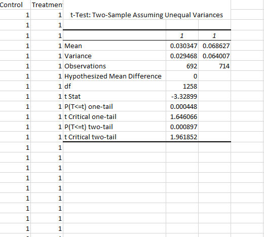

# KPI Experiment Analysis – Onboarding & Activation Campaign

## Business Context

This project analyzes a subscription-based digital product company’s onboarding and activation experiment. The goal of the campaign was to improve early user conversion and engagement by modifying the onboarding experience.

Users were divided into:
- Control group: Existing onboarding flow
- Treatment group: New onboarding and activation flow

The objective was to evaluate whether the new onboarding improves key business metrics without introducing operational risks.

---

## Dataset Description

The dataset consists of user-level onboarding and engagement data including:

- User signup and onboarding completion behavior
- Conversion timing data
- Engagement scores
- Support ticket interactions
- Refund-related indicators

The data was split into control and treatment groups for A/B testing analysis.

---

## North Star Metric Selected

**User Activation Rate (Early Conversion within onboarding window)**

This metric represents how effectively users reach meaningful product usage after signup.

---

## KPI Tree Summary

The KPI tree is structured into three main drivers:

1. **Acquisition Efficiency**
   - Signup completion rate
   - Drop-off rate

2. **Activation Quality**
   - Avg days to convert
   - First key action completion

3. **User Engagement**
   - Engagement score
   - Feature interaction depth

These drivers collectively influence the North Star metric.

---

## Experiment Analysis Approach

The analysis followed an A/B testing framework:

- Control vs Treatment comparison
- KPI-level metric evaluation
- Guardrail metric monitoring
- Segment-level performance analysis

Descriptive statistics were used to compare performance between groups.

---

## Hypothesis Test Summary

- Null Hypothesis (H0): No improvement in activation or engagement
- Alternative Hypothesis (H1): Treatment improves activation and engagement

Results showed:
- Improved conversion speed
- Improved engagement score

Thus, the null hypothesis is rejected for core performance metrics.

---

## Guardrail Metrics Considered

The following guardrails were evaluated:

- Refund Rate → No change (0%)
- Support Ticket Rate → Increased (moderate risk)
- Avg Days to Convert → Improved
- Engagement Score → Improved

**Key Insight:** Operational risk exists due to increased support ticket rate.

---

## Final Recommendation

**Conditional rollout is recommended.**

The treatment improves activation and engagement, but increased support demand indicates potential usability friction that must be monitored post-launch.

---

## Assumptions and Limitations

- Short-term experiment may not reflect long-term behavior
- Limited behavioral tracking beyond onboarding phase
- Segment-level differences may not generalize to all users
- External factors not controlled in experiment

---

## Screenshots

## KPI Tree

## Experiment Results

## Hypothesis Test Output

---
